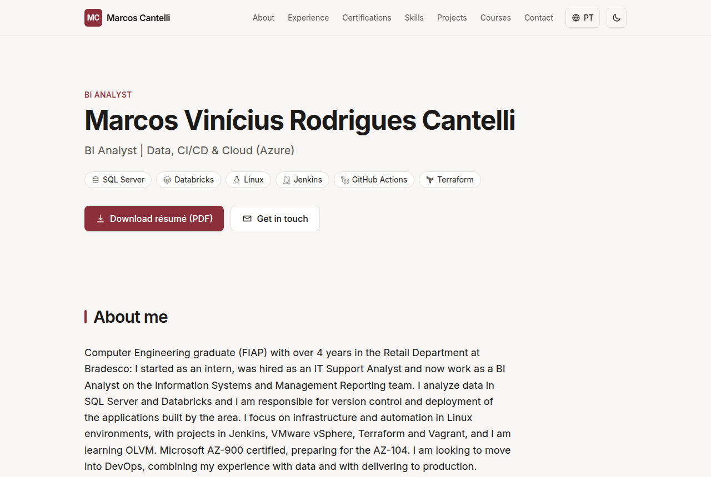
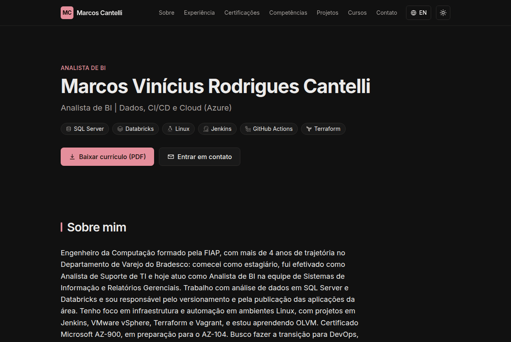
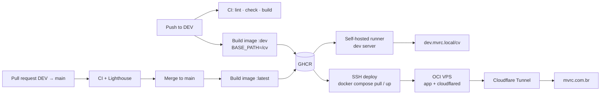

# CV-Page-MVRC

Personal résumé website of **Marcos Vinícius Rodrigues Cantelli** — BI Analyst moving into DevOps.
Live at **[mvrc.com.br](https://mvrc.com.br)** (Portuguese) and **[mvrc.com.br/en/](https://mvrc.com.br/en/)** (English).



<details>
<summary>Dark theme</summary>



</details>

## Features

- Bilingual (pt-BR / en-US) with Astro's native i18n, `hreflang` and a language switcher that keeps the current section.
- Light/dark theme following the OS, with a toggle saved in `localStorage`, no flash on load and View Transitions.
- Discreet scroll animations (`IntersectionObserver`, `transform`/`opacity` only) that are disabled with `prefers-reduced-motion`.
- Contact form backed by a server endpoint: Zod validation on both sides, Cloudflare Turnstile, honeypot, per-IP rate limit, and e-mail via Resend behind a swappable `Mailer` interface.
- Static pages + a single server route, served by a tiny Node wrapper that adds security headers (CSP with hashes, HSTS, etc.).
- Lighthouse 98–100 in all categories, WCAG AA contrast in both themes, JSON-LD `Person`, sitemap, Open Graph.

## Stack

| Area      | Tools                                                                    |
| --------- | ------------------------------------------------------------------------ |
| Framework | [Astro 7](https://astro.build) + TypeScript (strictest), `@astrojs/node` |
| Styling   | Tailwind CSS 4, Inter (self-hosted), Simple Icons (inlined SVG)          |
| Contact   | Zod, Cloudflare Turnstile, Resend                                        |
| Quality   | ESLint, Prettier, `astro check`, Lighthouse CI                           |
| Container | Multi-stage Docker image, distroless Node runtime, non-root              |
| Delivery  | GitHub Actions, GHCR, Cloudflare Tunnel, Oracle Cloud VPS                |

## Running locally

Requirements: Node.js 22+ and pnpm (`corepack enable`).

```bash
pnpm install
cp .env.example .env      # defaults use the Turnstile test keys and MAIL_DRIVER=log
pnpm dev                  # http://localhost:4321
```

Production build:

```bash
pnpm build
pnpm start                # node server.mjs -> http://localhost:4321
```

With Docker:

```bash
docker build -t cv-page-mvrc .
docker run --rm -p 4321:4321 --env-file .env -e HSTS=false cv-page-mvrc
```

Other scripts: `pnpm lint`, `pnpm format`, `pnpm check`.

## Environment variables

See [`.env.example`](.env.example) for the full, commented list.

| Variable                    | When    | Description                                                    |
| --------------------------- | ------- | -------------------------------------------------------------- |
| `MAIL_DRIVER`               | runtime | `resend` (default) or `log` (prints messages, for development) |
| `RESEND_API_KEY`            | runtime | Resend API key with sending access only                        |
| `CONTACT_FROM_EMAIL`        | runtime | Sender on a domain verified in Resend                          |
| `CONTACT_TO_EMAIL`          | runtime | Inbox that receives the messages                               |
| `TURNSTILE_SECRET_KEY`      | runtime | Turnstile secret key                                           |
| `PORT` / `HOST`             | runtime | Listen address (default `0.0.0.0:4321`)                        |
| `HSTS`                      | runtime | `false` to omit `Strict-Transport-Security` (plain HTTP)       |
| `TUNNEL_TOKEN`              | compose | Cloudflare Tunnel token (production)                           |
| `SITE_URL`                  | build   | Public URL (default `https://mvrc.com.br`)                     |
| `BASE_PATH`                 | build   | Base path (default `/`; the dev server uses `/cv`)             |
| `PUBLIC_TURNSTILE_SITE_KEY` | build   | Turnstile site key (public)                                    |

## Deployment

| Branch / tag | Image tags                   | Target                                                            |
| ------------ | ---------------------------- | ----------------------------------------------------------------- |
| `DEV`        | `dev`, `dev-sha-<commit>`    | On-premises dev server via a self-hosted runner (`/cv` base path) |
| `main`       | `latest`, `sha-<commit>`     | Oracle Cloud VPS via SSH, published through a Cloudflare Tunnel   |
| `v*`         | `<version>`, `<major.minor>` | Image only                                                        |

Images: `ghcr.io/marcoscantelli/cv-page-mvrc` (`linux/amd64`).



On the server the stack is just `docker-compose.yml` + `.env` in `/opt/cv-page-mvrc`:

```bash
docker compose pull && docker compose up -d
```

The full step-by-step setup (Resend, Turnstile, Cloudflare Tunnel, GitHub secrets, VPS and dev
server) is in [`docs/SETUP.md`](docs/SETUP.md) (Portuguese).

## Project structure

```
src/
  content/      CV data (cv.pt.ts, cv.en.ts) and UI strings — content is separate from layout
  components/   Page sections (Hero, Experience, Certifications, Contact, …)
  lib/          i18n, contact schema, Turnstile, rate limit, mail/ (Mailer interface + Resend)
  pages/        / and /en/ (static), /api/contact (server)
  assets/       Company logos and certification badges (optimized at build time)
server.mjs      Node server: security headers + /healthz around the Astro handler
deploy/         Dev-server compose, Caddy alternative, deploy script
```

## License

The source code is released under the [MIT License](LICENSE).

**The résumé content (texts in `src/content/`, the PDFs in `public/cv/`), photos, company logos and
certification badges are not covered by the MIT License** and remain the property of their
respective owners. Please do not reuse them.
